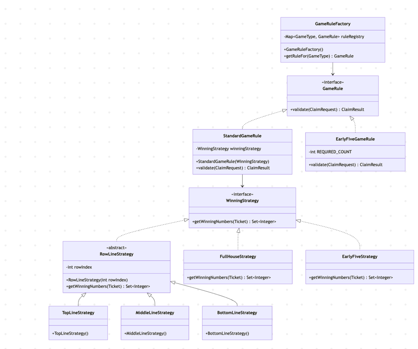

## How to run the unit test cases?

1. "mvn test" from terminal 
or 
2. open code in any IDE and run from src/test/java

## Business aspects in the problem statement

| Nouns             | Verbs    |
|-------------------|----------|
| Number            | Announce |
| Ticket            | Cross    |
| Claim             | Claim    |
| Player            | Validate |
| Game              | Match    |
| Round             | Win      |
| Dealer            | Accept   |
| Row               | Reject   |
| Game Type         | Complete |
| Winning Pattern   | Hold     |
| Slot              | Parse    |
| Claim Result      | Resolve  |
| Game Rule         |          |
| Winning Strategy  |          |
| Announced Numbers |          |

## Design & Coding aspects considered for this solution

1. Package structuring
2. Modelling the classes
3. OOPS (Encapsulation, Abstraction, Inheritance etc)
4. SOLID (SRP, OCP, LSP, ISP, DInv)
5. DRY, YAGNI, KISS
6. Design Patterns (Creational, Structural, Behavioural)
7. Naming Conventions
8. Immutability
9. Java Programming Best Practices
10. JVM, Heap, GC, Threads, Memory, CPU Usage
11. Exception handling
12. Data Structuring (Java Collections)
13. Unit Testing

## Candidates which can be extended in future (Open Closed Principle)

> Be thoughtful on YAGNI as well

1. Game Type (Ex: Fourth Line can be added in the game)
2. Game Rule (New rule for the new game type)
3. New Winning Strategy for new game

The core of the system is -> this Class Diagram

1. GameRule(s)
2. GameFactory
3. WinningStrategy(s)

